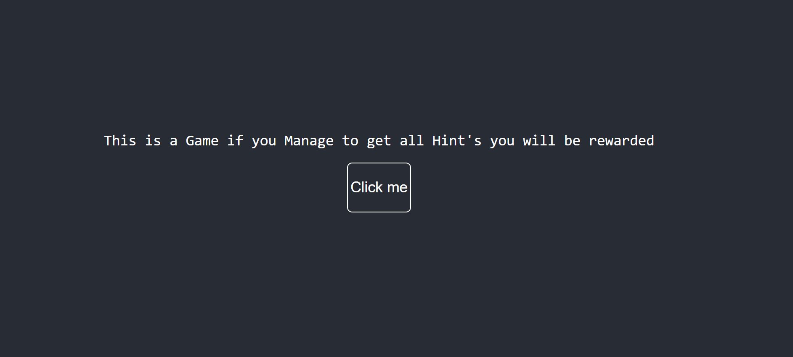

# Riddle 🎲🧩

> A React-based web riddle game — challenge your mind, solve riddles, and have fun!

---

## About

Riddle is a fun and interactive **React** web application where users can solve riddles, submit answers, and get instant feedback.  
It’s lightweight, responsive, and easy to extend with new riddles — perfect for testing your brain or sharing with friends.

---

## Features ✨

- Display riddles dynamically
- Accept user answers and validate correctness
- Responsive UI for mobile and desktop
- Easy to add new riddles
- Fun and educational

---

## Tech Stack 🛠️

- **Frontend:** React, HTML, CSS, JavaScript
- **State Management:** React Hooks / Context API
- **Hosting:** Vercel (Live Demo)

---

## Demo 🎬

Try the live version here: [Riddle Live Demo](https://riddle-amber.vercel.app)

  
_Screenshot of the app — update the path if you place it elsewhere._

### GIF Demo 🎥

  
_See the game in action!_

---

## Contributing 🤝

Contributions are welcome! Improve the UI, add riddles, or add new features.
Fork the repo, make changes, and open a pull request.

---
